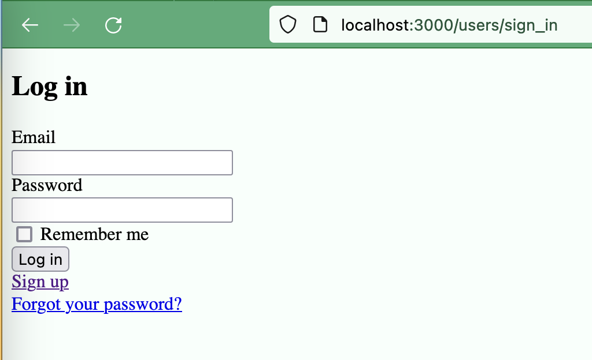
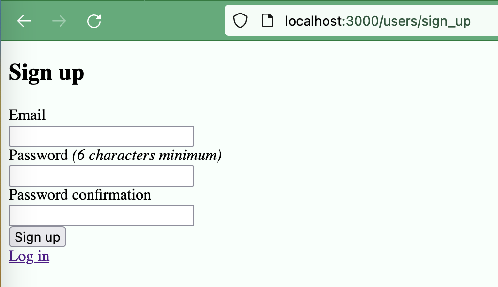
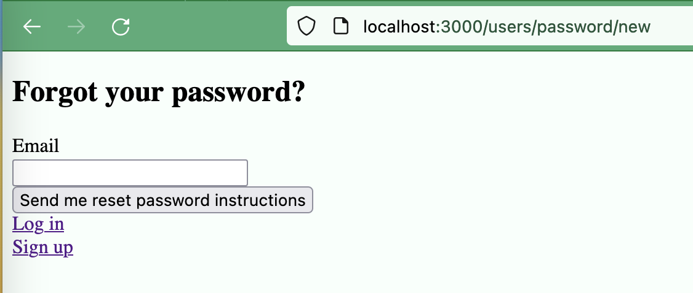
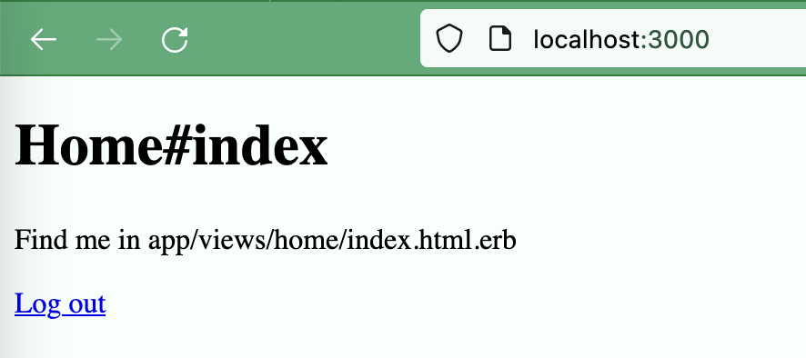

# rails-vite-react-typescript-devise-example
Example of a project using Ruby on Rails as backend, Vite with React as frontend (using Typescript) and the devise gem for user authentication.

# Getting started

## Backend

### Set up Rails with Devise

#### 1. Create a new rails project
    # Create a new rails project
    $ rails new rails-vite-react-typescript-devise-example
    $ cd rails-vite-react-typescript-devise-example

    # Add required gem
    $ bundler add devise

    # Scaffold the app
    $ rails g devise:install
    $ rails g devise User

    # Generate a home controller for us to test against
    $ rails g controller home index

#### 2. Update the dev environment settings
    # config/environments/development.rb

    config.action_mailer.default_url_options = { host: 'localhost', port: 3000 }

#### 3. Require authentication for the home controller
    # app/controllers/application_controller.rb

    class ApplicationController < ActionController::Base
      before_action :authenticate_user!
    end

#### 4. Setup routing
    # config/routes.rb

    Rails.application.routes.draw do
      devise_for :users

      root 'home#index'
    end


#### 5. Setup the Devise initializer
    # config/initializers/devise.rb

    # Uncomment the following line
    config.navigational_formats = ['*/*', :html, :turbo_stream]

#### 6. Update Home view
    # app/views/home/index.html.erb

    <h1>Home#index</h1>
    <p>Find me in app/views/home/index.html.erb</p>
    <%= link_to "Log out", destroy_user_session_path, data: { "turbo-method":
    :delete } %>

#### 7. Start the server (localhost:3000)
    $ rails db:create db:migrate
    $ rails s

#### 8. User pages
Login

Sign Up

Forgot Password

Home page after signing up


### Integrate Tailwind CSS
#### 1. Add Tailwind CSS to the project
    $ bundler add tailwindcss-rails
    $ rails tailwindcss:install
    
### Set up Vite with React and Typescript
#### 1. Create a new vite project
    $ bundler add rack-cors
    $ rails g controller session index
    $ touch config/initializers/cors.rb
    $ npm create vite@latest frontend
    $ cd frontend
    $ npm install

#### 2. Add Eslint 
    $ npx eslint --init   

#### 3. Change Eslint config
    # Add the following to the .eslintrc.js file
    parserOptions: {
      ...
      project: './frontend/tsconfig.json'
    ...
    rules: {
    'react/react-in-jsx-scope': 'off',
    'react/prop-types': 'off'
    }

#### 4. Update the Procfile.dev file to run both the rails server and the vite server
    # Procfile.dev

    web: bundle exec rails s -p 3000
    vite: cd frontend && npm run dev

#### 5. Run using the Procfile.dev
    $ bin/dev
#### 6. Update files inside the Vite project
```
# Install react Router
$ npm install react-router-dom
```
```
# frontend/src/main.tsx

import * as React from 'react'
import ReactDOM from 'react-dom/client'
import './index.css'

import App from './App'

ReactDOM.createRoot(document.getElementById('root')).render(
  <React.StrictMode>
    <App />
  </React.StrictMode>
)
```
```
# frontend/src/App.tsx

import { BrowserRouter as Router, Route, Routes } from 'react-router-dom'
import './App.css'

import HomePage from './pages/HomePage'

const App = (): JSX.Element => {
  return (
    <>
      <Router>
        <Routes>
          <Route path="/" element={<HomePage />} />
        </Routes>
      </Router>
    </>
  )
}

export default App
```

#### 7. Pass the CSRF token with the requests
    # Install Axios for executing requests
    $ npm install axios
```
# Create a new file to update the axios config
# frontend/src/axios.ts

import axios from "axios"

axios.defaults.xsrfCookieName = "CSRF-TOKEN"
axios.defaults.xsrfHeaderName = "X-CSRF-Token"
axios.defaults.withCredentials = true

export default axios
```
Update the Rails API

    # app/controllers/application_controller.rb

    class ApplicationController < ActionController::Base
      protect_from_forgery with: :exception

      before_action :set_csrf_cookie
      before_action :authenticate_user!

      private

      def set_csrf_cookie
        cookies['CSRF-TOKEN'] = form_authenticity_token
      end
    end

Update the Session controller
  
      # app/controllers/session_controller.rb
  
      class SessionController < ApplicationController
        skip_before_action :authenticate_user!
        
        def index
        end
      end

Update app to grab the initial CSRF token
  
      # frontend/src/app.tsx
  
      import { useEffect } from 'react'
      import { BrowserRouter as Router, Route, Routes } from 'react-router-dom'
      import axios from './axios'
      import './App.css'

      import HomePage from './pages/HomePage'

      const App = (): JSX.Element => {
        useEffect(() => {
          axios.get('http://localhost:3000/session')
        }, [])

        return (
          <>
            <Router>
              <Routes>
                <Route path="/" element={<HomePage />} />
              </Routes>
            </Router>
          </>
        )
      }

      export default App

Configure CORS
  
    # config/initializers/cors.rb

    Rails.application.config.middleware.insert_before 0, Rack::Cors do
      allow do
        origins 'localhost:3000', 'localhost:5173'

        resource '*',
                headers: :any,
                methods: %i[get post put patch delete options head],
                credentials: true
      end
    end

Turn off the forgery protection origin check

    # config/application.rb

    require_relative 'boot'

    require 'rails/all'

    # Require the gems listed in Gemfile, including any gems
    # you've limited to :test, :development, or :production.
    Bundler.require(*Rails.groups)

    module DemoRails7WithDeviseSeries
      class Application < Rails::Application
        # Initialize configuration defaults for originally generated Rails version.
        config.load_defaults 7.0

        # Configuration for the application, engines, and railties goes here.
        #
        # These settings can be overridden in specific environments using the files
        # in config/environments, which are processed later.
        #
        # config.time_zone = "Central Time (US & Canada)"
        # config.eager_load_paths << Rails.root.join("extras")

        # Since we will be using other origins
        config.action_controller.forgery_protection_origin_check = false
      end
    end

Update Home controller
    
    # app/controllers/home_controller.rb
  
    class HomeController < ApplicationController
      def index; end

      def create
        render json: { message: 'Welcome to the API' }
      end
    end

Update routes

    # config/routes.rb

    Rails.application.routes.draw do
      get 'session/index'
      devise_for :users
      # Define your application routes per the DSL in https://guides.rubyonrails.org/routing.html

      resources :session, only: [:index]
      resources :home, only: %i[index create]

      # Defines the root path route ("/")
      root 'home#index'
    end

<!-- ### Use Redis Session
*Prerequisite: Redis installed and running on localhost:6379*

*In MacOs:*

    $ brew install redis
    $ brew services start redis

    # Check if redis is running
    $ brew services info redis

    # Stop redis
    $ brew services stop redis
#### 1. Create required files and add gems
    $ bundler add redis-rails -->